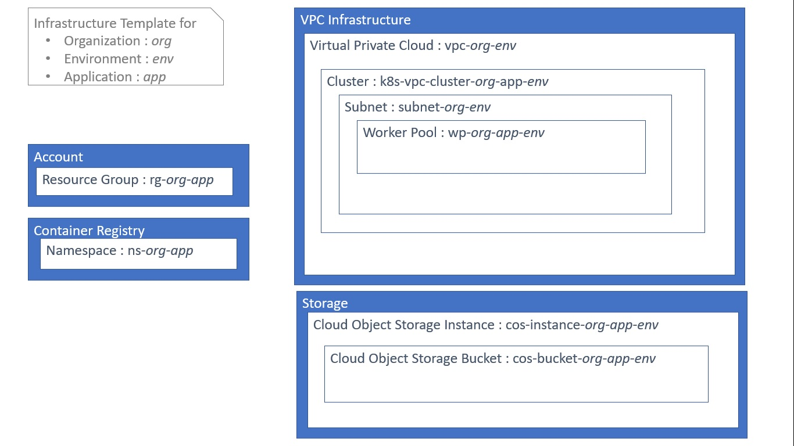

# Infrastructure Template for IBM Cloud

This repository  contains IaaC Terraform templates to create an IBM Cloud infrastructure including:
* A Virtual Private Cloud
* A Kubernetes Cluster
* A Cloud Object Storage bucket
* A Container Registry Namespace
* A Resource Group


## Infrastructure Overview



## Project Structure
```
infra-ibm.tf
   +- README.md : This file
   +- terraform
      +- main.tf : Resources creation instructions
      +- variables.tf : Defaulted and mandatory variables 
```

## Mandatory Variables

- The organisation/application and environment structure  
  + **org** : code name of an organisation containing hosting applications   
  + **app** : code name of an application hosted in an organization  
  + **env** : code name of en environment in wich to deploy the application (dev, uat, etc. )


- Connection to IBM Cloud
  + **ibmcloud_api_key** : IBM Cloud IAM key used to provision resources  

create a K8S cluster in a single zone in a VPC


## ibmcloud CLI _mini cheat sheet_

* List available zones 
```
$ ibmcloud ks locations
```

* List available machines flavors
```
$ ibmcloud ks flavors --zone LOCATION
```
_Ex for VPC Zone eu-de-1 : bx2.2x8_  
_Ex for Classic Zone fra02 : b3c.4x16_

## Resources
Terraform : https://www.terraform.io/
IBM Cloud Provider for Terraform : https://registry.terraform.io/providers/IBM-Cloud/ibm/latest/docs
VPC Cluster Creation Sample : https://registry.terraform.io/providers/IBM-Cloud/ibm/latest/docs/resources/container_vpc_cluster